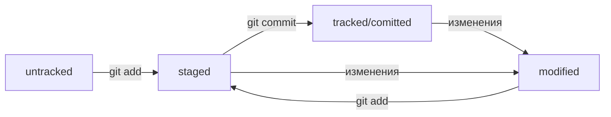

# Command for work
* pwd - Путь к папке нахождения 
* cd - Переход куда-нибудь  ~ - домой, при пробелах в названии использовать кавычки, переход на уровень выше ..
* ls - Вывод файлов и папок в директории, -a показывает скрытые файлы
* touch - Для создания файла
* mkdir - Для создания директории  -p для создания структуры дериктории
* cp что_копируем куда_копируем, можно указывать через пробел несколько файлов, которые мы копируем
* mv - перенос папки
* cat - читает файл
* rm - удаление файла из текущей директории
* rmdir - удаление директории
* rm -r навзание директории - удаление всей директории
* для ввода сразу нескольких команд подряд в одну строку, используется &&
* rm -rf .git # удалили подпапку .git 
* git add - начинает отслеживать файлы
* git log  - история комиитов

---

# Conventional Commits

Conventional Commits предлагает такой формат коммита: <type>: <сообщение>. 
Первая часть type — это тип изменений. Таких типов достаточно много. Вот два примера:
1. feat (сокращение от англ. feature) — для новой функциональности;
2. fix (от англ. «исправить», «устранить») — для исправленных ошибок.

---

# Status of commit

HEAD -- это папка в гит, в которой хранится хэш последнего коммита.
Коммит -- это сохранение файлов.
Статусы файлов:
git status

